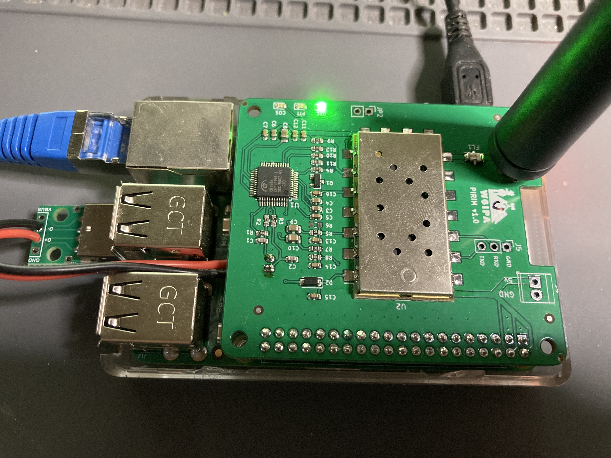
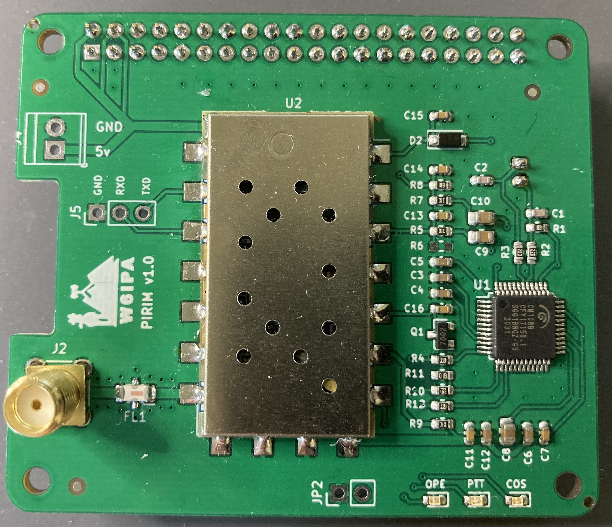
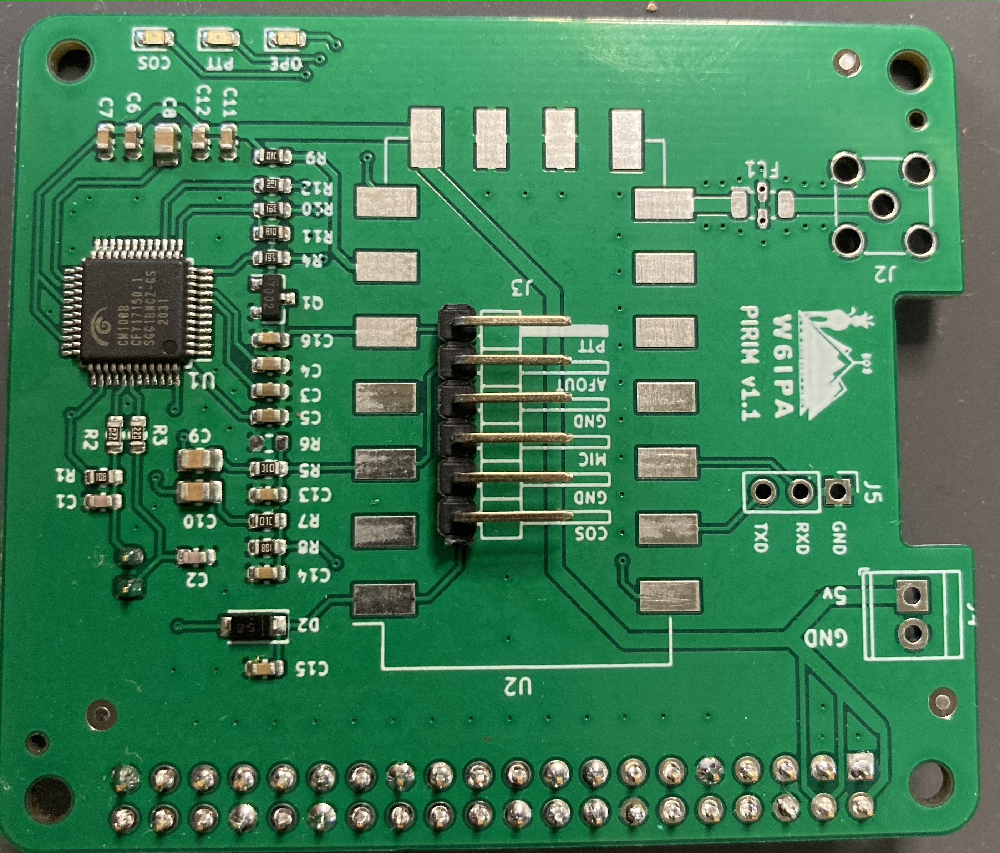

## PI Radio Interface Module

CM108b based Radio Interface Module in a raspberry Pi HAT format. Ideal to build an AllStar node based on [AllStarLink Raspberry PI images](http://dvswitch.org/files/ASL_Images/Raspberry_Pi/Stretch/)

The board can be used in two configurations:

- SA818 VHF or UHF module with serial RX/TX directly to Raspberry PI GPIO RX/TX. Supports MiniCircuits Low Pass filters ( FV1206 case)
- Connector to interface with a radio like Yaesu FT7900 or TYT TH-9000D

The connection to the Raspberry PI is through a USB port. The interface has a provision for a JST PH connector which can be used to add, for example, a usb breakout board connecting only D+ and D-.

Depending on the type of configuration, the recommended parts are:

- 490Mhz Low Pass Filter 139-LFCN-490 (Mouser) if using SA818 UHF
- 160Mhz Low Pass Filter 139-LFCN-160 (Mouser) if using SA818 VHF
- SMA connector like 471-SMACONNECTOR (Mouser)
- 2x20 pin connector for Raspberry pi GPIO
- JST PH 2 pin right angle through hole 474-PRT-09749 (Mouser) or cheaper
- JST PH pigtail https://www.amazon.com/gp/product/B07Q128X2V
- USB A Male breakout board https://www.amazon.com/gp/product/B07MQFJQLT
- 1x6 right angle pin header (if not using SA818)

If using the SA818 modules, I recommend [0x9900's](https://0x9900.com) python code available here : [https://github.com/0x9900/SA818](https://github.com/0x9900/SA818)

See also his excellent blog posts on the interface:

- [Programming the radio module SA818](https://0x9900.com/programming-the-radio-module-sa818/)
- [Connecting your TYT on a Raspberry-Pi](https://0x9900.com/connecting-your-tyt-on-a-raspberry-pi/)

### Images of assembled boards
#### In use

#### Assembled with radio

#### Assembled with connector

     
